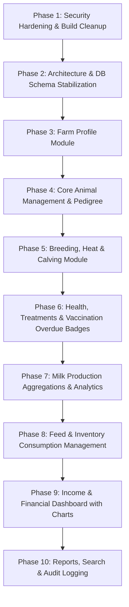

# MFarm — Comprehensive Project Audit & Security Hardening Report

**Project Name:** MFarm (DailyFarm)  
**Package Name:** `dev.mfarm.com.mfarm`  
**Target Platform:** Android (minSdk 21, targetSdk 33, compileSdk 33)  
**Database Name:** `farmapp.sqlite`  
**Audit Date:** May 2026  

---

## 1. CURRENT ARCHITECTURE

The project follows a classic Android Monolithic / Model-View-Controller (MVC) architecture using Java and standard AndroidX components.

```text
Android UI (Activities & Fragments)
       ↓
Business Logic & Event Handlers
       ↓
Database Helper / SQLite Statements (SQLiteDatabase)
       ↓
Local SQLite Database (`farmapp.sqlite` in App Data)
```

### Components
* **Presentation Layer:** Standard Android `Activity` and `Fragment` components. Navigation is managed via `MainActivity` with a `DrawerLayout` and `NavigationView`.
* **Data Layer:** Monolithic `DatabaseHelper` (extends `SQLiteOpenHelper`) providing direct access to `SQLiteDatabase`. Database asset `assets/farmapp.sqlite` is pre-populated and copied to `/data/data/dev.mfarm.com.mfarm/databases/farmapp.sqlite` on first app run.
* **Sync Subsystem (`dev.mfarm.com.mfarm.sync`):** Offline-first peer-to-peer sync engine using SQLite triggers (`trg_<table_name>_ai`, `trg_<table_name>_au`, `trg_<table_name>_ad`) and a `sync_index` table tracking record UUIDs and modification timestamps for last-write-wins merging into client-side encrypted JSON backups (`.mfarm` files encrypted via PBKDF2WithHmacSHA1 + AES/CBC/PKCS5Padding).

---

## 2. EXISTING SCREENS

| Screen | Activity / Fragment File | Purpose | Database Dependency | Current Status |
| :--- | :--- | :--- | :--- | :--- |
| **Dashboard** | `MainActivity` + `DashboardFragment` | Primary hub with quick action buttons & sync status banner | Reads `sync_state`, `sync_index` | WORKING |
| **Animal List** | `AnimalListFragment` | Lists registered farm animals | `animas` | WORKING |
| **Animal Registration (Step 1)** | `RegisterActivity` | Collects name, breed, gender, dob, body conformance | `breeds` | WORKING |
| **Animal Registration (Step 2)** | `RegistrationActivity2` | Collects dam/sire IDs, birth/weaning details | `GlobalVariables` | PARTIALLY WORKING (Weaning data discarded) |
| **Animal Registration (Step 3)** | `PhotoIntentActivity` | Captures camera image and persists animal record | `animas` | WORKING |
| **Animal Detail** | `AnimalDetailActivity` | Displays full animal record & photo; delete animal | `animas`, `breeds` | WORKING |
| **Milk Recording** | `MilkProductionActivity` | Log daily milk production in litres per cow | `animas`, `milk_production` | WORKING |
| **Milk Production List** | `MilkProductionListFragment` | Displays milk production history | `milk_production`, `animas` | WORKING |
| **Illness Occurence** | `IllnessActivity` | Log disease symptoms per cow | `animas`, `diseases`, `illness` | WORKING |
| **Medication & Treatment** | `TreatmentActivity` | View illness records & record diagnosis/medicine | `illness` | WORKING |
| **Vet Check** | `VetCheckActivity` | Record veterinary inspection notes | `animas`, `vet_checks` | WORKING |
| **Schedule Vaccination** | `ScheduleVaccinationActivity` | Schedule vaccine reminder with local alarm | `animas`, `vaccinations` | WORKING |
| **Vaccination List** | `VaccinationListFragment` | View upcoming/completed vaccinations | `vaccinations` | WORKING |
| **Add Breeding Record** | `AddBreedingActivity` | Record mating date & auto-calculate gestation (283 days) | `animas`, `breeding_records` | WORKING |
| **Breeding List** | `BreedingListFragment` | View breeding history | `breeding_records`, `animas` | WORKING |
| **Fertility Report** | `FertilityReportFragment` | Summary of pregnant cows and upcoming calvings | `breeding_records` | WORKING |
| **Add Inventory Item** | `AddInventoryItemActivity` | Add feed, medicine or supply items | `inventory` | WORKING |
| **Inventory List** | `InventoryListFragment` | Display current stock levels | `inventory` | WORKING |
| **Update Stock** | `StockTransactionActivity` | Record stock in/out transactions | `inventory`, `inventory_transactions` | WORKING |
| **Add Expense** | `ExpenseActivity` | Record farm financial expense | `expenses` | WORKING |
| **Expense List** | `ExpenseListFragment` | View expense transaction history | `expenses` | WORKING |
| **Export Data** | `ExportActivity` | Share animals, expenses, and milk logs as text | `animas`, `expenses`, `milk_production` | WORKING |
| **Farm Sync** | `FarmSyncActivity` | Create/join farm code, export/import encrypted backup, pick shared folder | `sync_index`, `sync_state` | WORKING |

---

## 3. EXISTING DATABASE TABLES

| Table Name | Purpose | Primary Key | Foreign Keys | Key Columns | Used By Screen |
| :--- | :--- | :--- | :--- | :--- | :--- |
| `animas` | Animal records | `id` (INTEGER) | `breed_id` -> `breeds.id` | `name`, `gender`, `body_conf`, `dob`, `body_color`, `dam_id`, `sire_id`, `photo_path` | Animal Registration, Detail, List |
| `breeds` | Breed lookup | `id` (INTEGER) | None | `name` | Animal Registration, Animal Detail |
| `diseases` | Disease lookup | `id` (INTEGER) | None | `disease_name` | Illness Activity |
| `illness` | Health/illness logs | `id` (INTEGER) | `animal_id` -> `animas.id` | `animal_name`, `illness_occured`, `sings_noted`, `date_occured`, `treatment`, `diagnosis`, `medicine` | Illness Activity, Treatment Activity |
| `milk_production` | Daily milk yield | `id` (INTEGER) | `animal_id` -> `animas.id` | `litres`, `datetime`, `description` | Milk Recording, Milk List, Export |
| `expenses` | Expense records | `id` (INTEGER) | None | `category`, `amount`, `date`, `description` | Expense Activity, Expense List, Export |
| `vaccinations` | Scheduled vaccines | `id` (INTEGER) | `animal_id` -> `animas.id` | `vaccine_name`, `scheduled_date`, `status`, `remarks` | Vaccination Activity, Vaccination List |
| `inventory` | Stock inventory | `id` (INTEGER) | None | `item_name`, `category`, `quantity`, `unit`, `min_quantity` | Inventory Activity, Inventory List |
| `inventory_transactions` | Stock movement | `id` (INTEGER) | `item_id` -> `inventory.id` | `type`, `quantity`, `date`, `remarks` | Stock Transaction Activity |
| `breeding_records` | Mating & pregnancy | `id` (INTEGER) | `animal_id` -> `animas.id` | `mating_date`, `bull_id`, `expected_birth_date`, `status` | Breeding Activity, Fertility Report |
| `vet_checks` | Vet inspections | `id` (INTEGER) | `animal_id` -> `animas.id` | `check_type`, `check_date`, `remarks` | Vet Check Activity |
| `sync_index` | Sync tracking | `uuid` (TEXT) | `local_id` -> internal | `table_name`, `updated_at`, `deleted` | Farm Sync Subsystem |
| `sync_state` | Sync metadata | `k` (TEXT) | None | `v` | Farm Sync Subsystem |

---

## 4. EXISTING WORKING FUNCTIONALITY

* Pre-populated SQLite database initialization and runtime schema extension via `DatabaseHelper`.
* Animal registration flow with camera photo capture and local image storage path persistence.
* Animal listing, detailed view, and deletion.
* Milk production entry per animal and production logs display.
* Illness occurrence entry and treatment update dialogs.
* Vaccination scheduling with local Android notifications (`AlarmScheduler`, `VaccinationReminderReceiver`, `BootReceiver`) and Android 13+ permission support.
* Breeding records with automatic expected calving date calculation (~283 days gestation).
* Basic fertility report tracking pregnant cows and 30-day calving estimates.
* Inventory management with stock in/out movements, minimum quantity thresholds, and transaction logs.
* Expense tracking and list view.
* Data export via plain text sharing (`Intent.ACTION_SEND`).
* Peer-to-peer encrypted backup/restore and continuous folder sync using Storage Access Framework (`FarmSyncManager`, `FarmCrypto`, `FarmSnapshot`, `FarmMerger`).

---

## 5. BROKEN FUNCTIONALITY

1. **`PullDatabase.java` SD Card Export:** Uses hardcoded `/data/data/dev.mfarm.com.mfarm/databases/...` path and legacy `Environment.getExternalStorageDirectory()` which fails on Android 10+ (API 29+) scoped storage model.
2. **`RegistrationActivity2` Data Loss:** Inputs for birth date, weaning date, birth weight, and weaning weight are collected in the UI but never saved to `GlobalVariables` or `animas` database table.
3. **Multi-Step Registration State:** Using static fields in `GlobalVariables` for `RegisterActivity` -> `RegistrationActivity2` -> `PhotoIntentActivity` causes data loss if the process is killed mid-flow.
4. **Breed Query Loop:** In `RegisterActivity`, the cursor query loop over breeds overwrites `breed_id` variable repeatedly instead of selecting directly.

---

## 6. PLACEHOLDER FUNCTIONALITY

* `GlobalVariables.dam_id` and `sire_id` default to hardcoded `"1"`.
* `PhotoIntentActivity.galleryAddPic()` is an empty stub.
* In `IllnessActivity`, fields `diagnosis`, `medicine`, `treatment_date` are saved as empty strings `""` initially until updated in `TreatmentActivity`.
* No Income/Sales tracking module exists yet (only Expenses).
* Financial reports lack profit/loss calculation and visual charts.

---

## 7. EXTERNAL APIS / SERVICES

* **None.** The application contains zero external REST APIs, cloud databases, or web service calls. It is completely offline and self-contained.

---

## 8. INTERNET / NETWORK DEPENDENCIES

* `AndroidManifest.xml` includes `INTERNET` and `ACCESS_NETWORK_STATE` permissions.
* `FarmNetwork.java` checks connectivity state solely to display an "Online" or "Offline" status indicator in the Farm Sync banner.
* **No network connection is required for any core app functionality.**

---

## 9. HARD-CODED SECRETS OR CREDENTIALS

> [!WARNING]
> **CRITICAL SECURITY FINDING IN BUILD SCRIPT**
> * **Location:** `app/build.gradle` (lines 17–24)
> * **Component:** `android.signingConfigs.release`
> * **Finding:** Keystore store password (`storePassword`) and key password (`keyPassword`) are hardcoded directly in the build file.
> * **Recommendation:** Remove plain-text passwords from `app/build.gradle` and load them securely from environment variables or `gradle.properties` (which should be added to `.gitignore`).

No API keys or cloud tokens (Firebase, Supabase, Google, Stripe, etc.) were found in source code.

---

## 10. THIRD-PARTY LIBRARIES

* `androidx.appcompat:appcompat:1.6.1`
* `com.google.android.material:material:1.9.0`
* `androidx.constraintlayout:constraintlayout:2.1.4`
* `androidx.cardview:cardview:1.0.0`
* `androidx.documentfile:documentfile:1.0.1`
* `junit:junit:4.13.2` & `androidx.test.espresso:espresso-core:3.5.1`

---

## 11. PERMISSIONS

* `android.permission.INTERNET`
* `android.permission.ACCESS_NETWORK_STATE`
* `android.permission.WRITE_EXTERNAL_STORAGE`
* `android.permission.RECEIVE_BOOT_COMPLETED`
* `android.permission.SCHEDULE_EXACT_ALARM`
* `android.permission.POST_NOTIFICATIONS`
* `android.hardware.camera` (Optional feature)

---

## 12. LICENSE / COPYRIGHT INFORMATION

* Repository lacks an explicit `LICENSE` file or `README.md`.
* Package name: `dev.mfarm.com.mfarm`.
* Author reference in source files: `SIMGICH`.
* **Recommendation:** Include standard copyright notices and a commercial client license agreement before final delivery.

---

## 13. EXISTING OFFLINE CAPABILITY

* **100% Offline First.**
* SQLite database stores all records locally on the device.
* App functions completely without cell service or Wi-Fi.

---

## 14. DATA BACKUP CAPABILITY

* **Encrypted Snapshot Backup:** `.mfarm` files encrypted using PBKDF2 key derivation and AES-128-CBC encryption (`FarmCrypto.java`).
* **Storage Access Framework Sync:** Continuous folder sync via `DocumentFile` tree URI (`FarmSyncManager.java`).
* **Export / Import:** Supports sharing via standard Android Share Sheet (`Intent.ACTION_SEND`) and importing via Document Picker (`Intent.ACTION_OPEN_DOCUMENT`).

---

## 15. MISSING FARM-MANAGEMENT FUNCTIONALITY

1. Farm Profile settings (farm name, owner, location, phone, currency, measurement units).
2. Comprehensive Animal status management (Active, Pregnant, Lactating, Dry, Sick, Quarantined, Sold, Dead, Transferred).
3. Calving / Birth registration module (creating offspring automatically linked to dam and sire).
4. Detailed health management (dosage, veterinarian costs, batch numbers, overdue vaccination badges).
5. Milk production aggregations (morning/evening logs, daily/weekly totals, per-animal averages).
6. Feed management & feed consumption tracking (feed stock balance, low stock warnings).
7. Income & sales management (milk sales, animal sales, manure sales).
8. Financial Dashboard (Income vs Expenses, Net Profit/Loss, visual charts).
9. Full-text search and filtering across all modules.
10. Farm Audit Log (record creation, edits, deletions, backups).

---

## 16. RECOMMENDED IMPLEMENTATION SEQUENCE



---

## 17. RISKS TO RESOLVE BEFORE CLIENT DELIVERY

1. **Security Risk:** Hardcoded keystore passwords in `app/build.gradle`.
2. **Data Integrity Risk:** Multi-step animal registration state loss if app process is killed.
3. **Data Loss Risk:** Missing foreign key constraints or cascade rules in raw SQLite database.
4. **Compatibility Risk:** Legacy SD card export code in `PullDatabase.java` broken on Android 10+.
5. **Legal Risk:** Missing formal license and copyright headers for commercial delivery.
